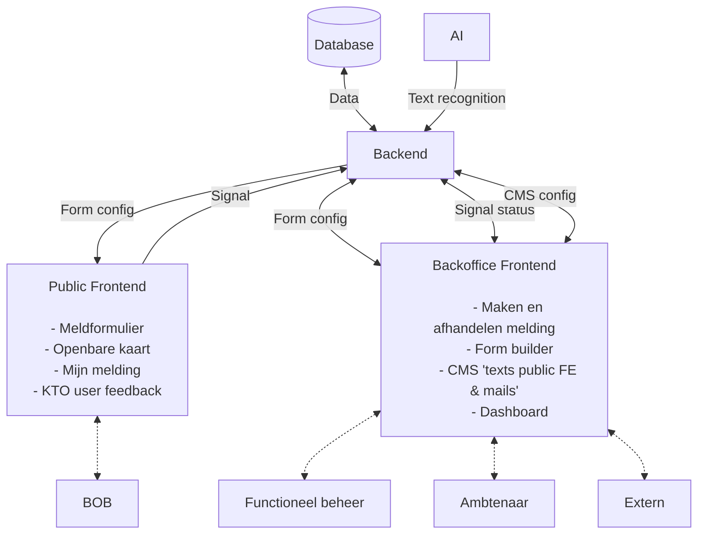

# Architecture

```mermaid
graph TD
    DB[("Database")] <-->|Data| BE["Backend"]
    AI -->|Text recognition| BE["Backend"]
    BE -->|Form config| PFE["
        Public Frontend

        - Meldformulier
        - Openbare kaart
        - Mijn melding
        - KTO user feedback
    "]
    PFE -->|Signal| BE
    BE <-->|Form config| BFE["
        Backoffice Frontend

        - Maken en afhandelen melding
        - Form builder
        - CMS 'texts public FE & mails'
        - Dashboard
    "]
    BE <-->|Signal status| BFE
    BE <-->|CMS config| BFE
    PFE <-.-> BOB
    BFE <-.-> FB["Functioneel beheer"]
    BFE <-.-> AMBT["Ambtenaar"]
    BFE <-.-> EXT["Extern"]
```
